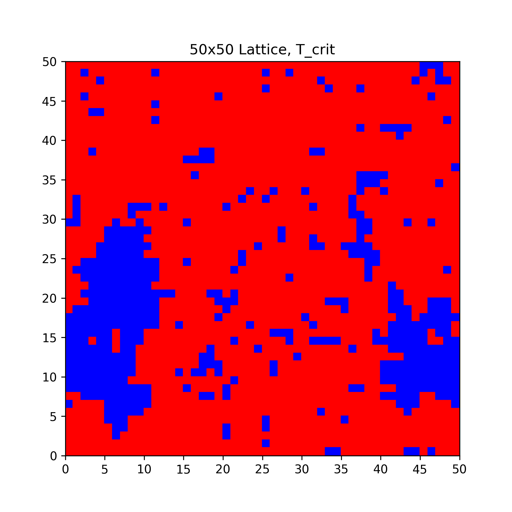
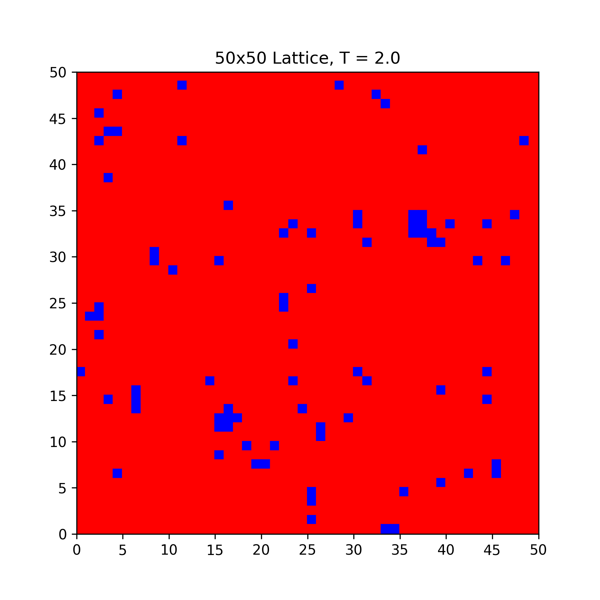
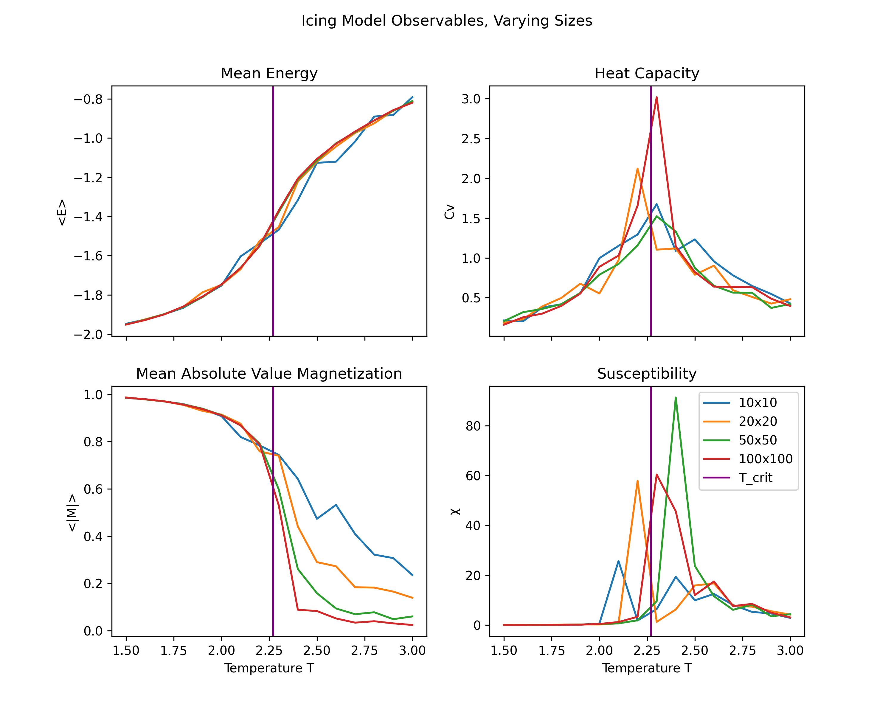
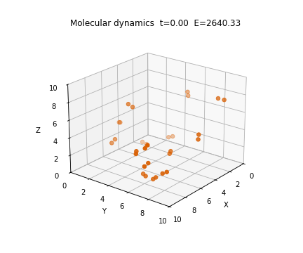
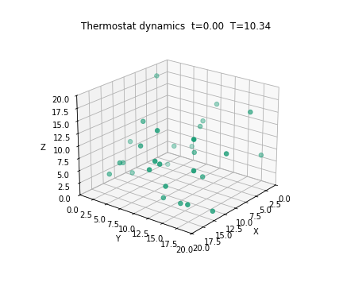

# Physics-Simulations

Collection of small C++ physics simulation projects exploring lattice models, particle systems, and molecular dynamics. Each subdirectory is a self-contained experiment with its own source code, generated data, plotting workflow, and report.

## Projects

### `icing-model`

2D Ising model simulation built with CMake and written in C++. The code in `src/` evolves a lattice across a temperature range, writes observables and lattice states to CSV, and uses the Python plotting script in `scripts/` to generate the figures stored in `output/`. This directory also includes saved lattice datasets and a report PDF.

### `icing-model-cluster-algorithms`

Extension of the Ising work that compares several update strategies, including Metropolis, Wolff, and Swendsen-Wang style cluster updates. The C++ implementation is organized similarly to `icing-model`, with CMake-based builds, CSV output, Python plotting utilities, and a report discussing the algorithmic comparison.

### `particle-dynamics`

Standalone particle simulation in `particles.cpp` for particles moving in a 3D box with Lennard-Jones interactions and periodic boundary conditions. Output is written to `datafolder/`, while `plot_data.ipynb` is used to visualize observables and produce animations from the saved trajectories. A short README, Python requirements file, and report PDF are included.

### `molecular-dynamics`

Set of related C++ simulations for diatomic molecules and thermostat-controlled particle systems. The directory contains separate executables for molecules, particles with a Nose-Hoover thermostat, and an extended equilibrium run, along with CSV output, a plotting notebook, Python dependencies, and the accompanying report PDF.

## Repository Layout

- `icing-model/` - single-spin-flip Ising simulations and plotting utilities
- `icing-model-cluster-algorithms/` - Ising simulations with cluster-update methods
- `particle-dynamics/` - particle trajectory simulation and notebook-based analysis
- `molecular-dynamics/` - molecular and thermostat dynamics experiments

## Sample Output

Lattice configurations, observable plots, and notebook-generated animations from the simulations are already committed in the repository:

## Notes

- The Ising projects use CMake for building their C++ executables.
- The particle and molecular projects are centered around standalone C++ programs plus Jupyter notebooks for plotting and animation.
- CSV output and generated figures live alongside the code inside each project directory.
